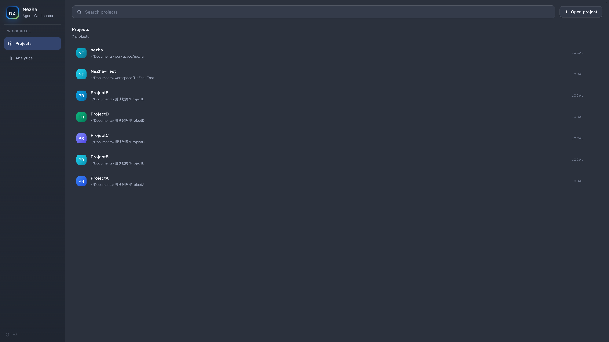
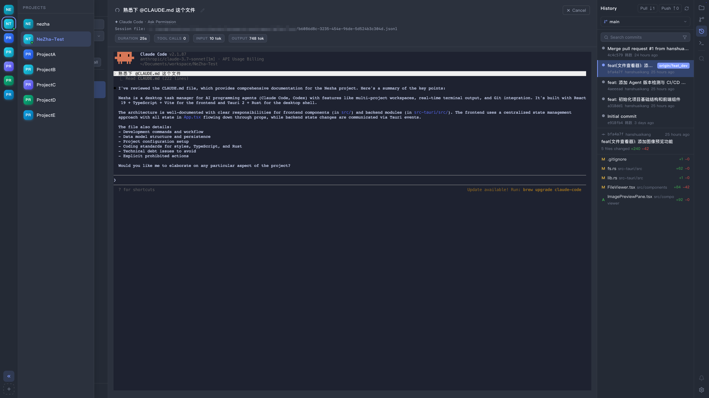
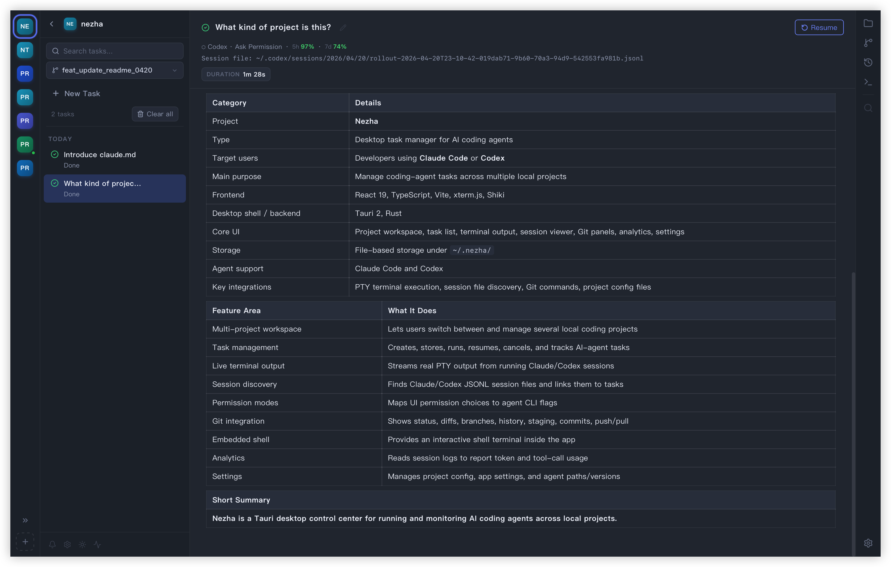
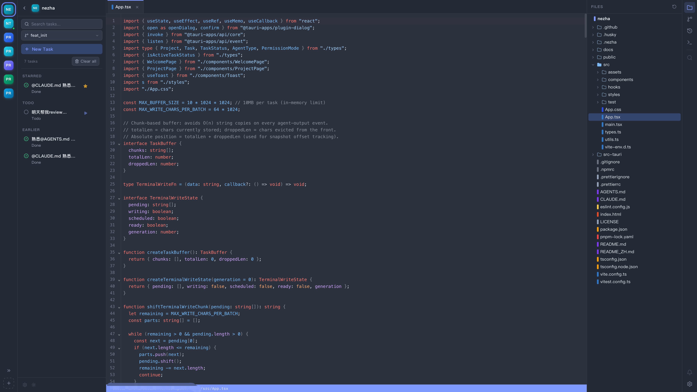
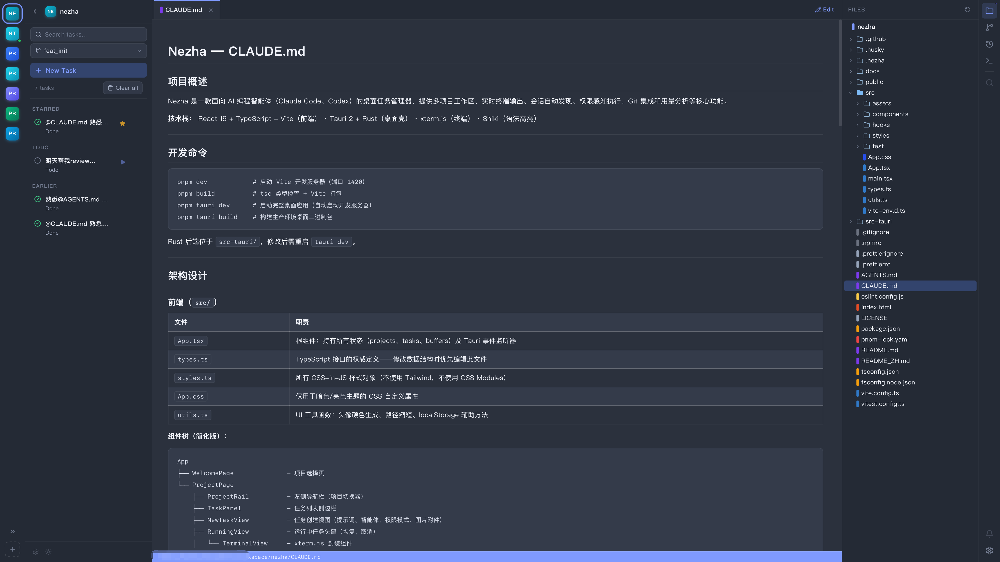
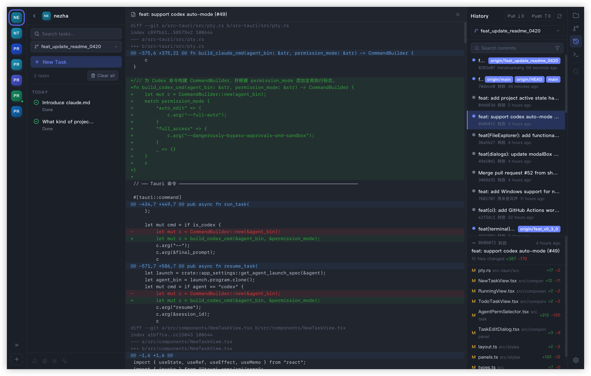
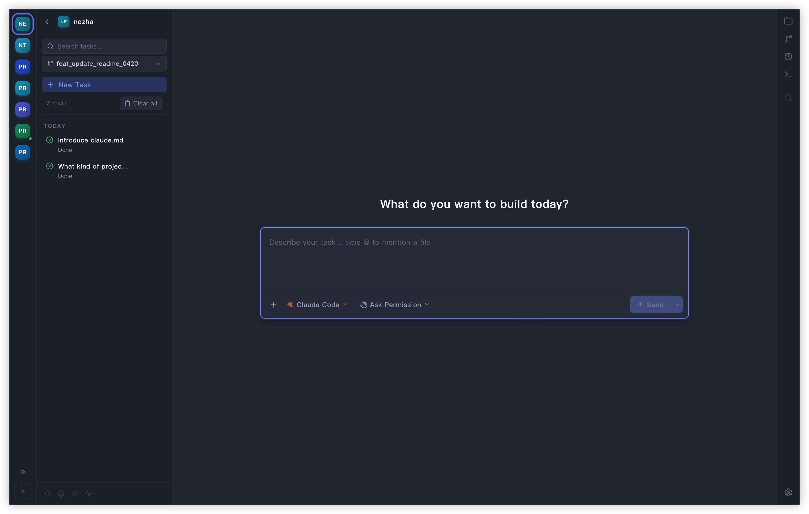
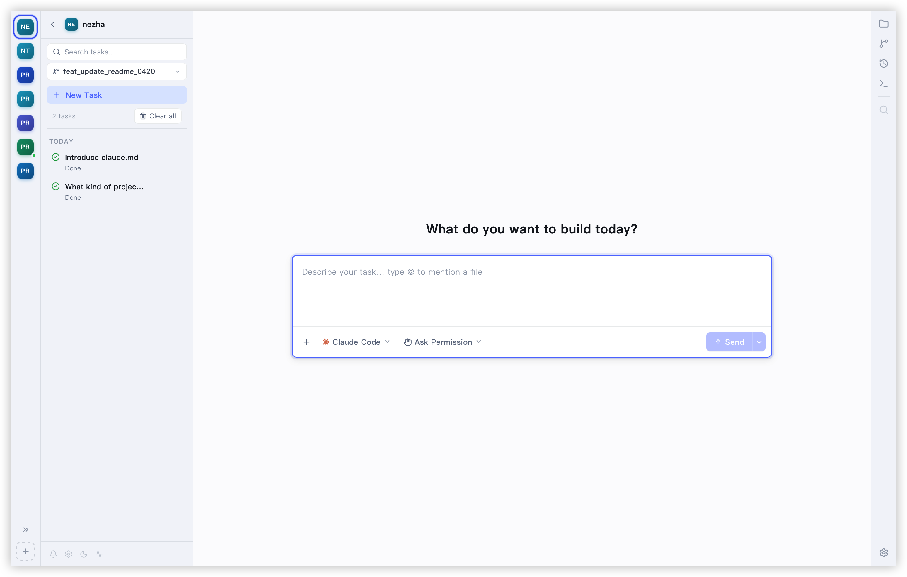

> **Nezha Plus 说明**
>
> 当前仓库代表 **Nezha Plus**，即基于上游 Nezha 的 `personal/extensions` 增强线。Nezha Plus 保留 Nezha 的核心体验，同时加入面向个人工作流的 fork-only 功能、流程增强和个人发布处理。

<p align="center">
  
</p>

<h1 align="center">Nezha Plus：面向 AI 编程智能体的增强版桌面工作台</h1>

<p align="center">
  基于 Nezha 的增强分支，为 AI 编程工作流加入更多个人效率扩展
</p>

<p align="center">
  多项目工作区 · 快速切换多个项目的 vibecoding 任务 · 实时终端 · 会话自动发现 · 原生 Git 集成 · 轻量级代码编辑器 · Nezha Plus 扩展能力
</p>
<p align="center">
  <a href="https://github.com/hanshuaikang/nezha/actions/workflows/checks.yml"></a>
  <a href="https://github.com/NAMEWTA/nezha/releases"></a>
  <a href="https://github.com/hanshuaikang/nezha/stargazers"></a>
</p>

<div align="center">
  <table>
    <tr>
      <td align="center">
        <a href="https://www.producthunt.com/products/nezha-2?embed=true&utm_source=badge-featured&utm_medium=badge&utm_campaign=badge-nezha" target="_blank" rel="noopener noreferrer">
          
        </a>
      </td>
      <td align="center">
        <a href="https://hellogithub.com/repository/hanshuaikang/nezha" target="_blank" rel="noopener noreferrer">
          
        </a>
      </td>
    </tr>
  </table>
</div>

<p align="center">
  
</p>

Nezha Plus 是基于上游 Nezha 的增强版桌面应用，面向 AI 编程场景和多智能体并行工作流。它保留 Nezha 的多项目管理、任务生命周期追踪、原生终端体验、会话回放、代码浏览和完整 Git 工作流，同时在此基础上加入面向个人效率的扩展能力，例如更强的 Git 查看体验、快捷键定制、个人发布链接和其他 fork-only 工作流增强。

你仍然可以在同一个界面中运行 Claude Code 和 Codex，快速切换不同项目或任务，不必在终端、编辑器、Git 工具和会话记录之间来回切换。

## 为什么是 Nezha Plus

传统的 IDE 和 VS Code 这样的编辑器本质上是以开发者为核心设计的，在古法编程时代，插件系统、重构、变量联想等诸多功能都是为了提升效率而存在。而现在 AI 写的代码越来越多，写代码本身真的开始并行了，这在以前是不敢想的事情。但是人的注意力是有限的，如何快速跟踪多个项目的任务，就是 Nezha Plus 延续并增强解决的问题。

Nezha Plus 延续 Nezha 的 Agent 优先设计，内置终端直接集成原生 Claude Code 和 Codex，并在此之上集成任务系统、Git、终端和代码编辑器。Plus 线承载的是这个 fork 中新增的增强能力：它们服务于个人工作流和本分支的发布节奏，不一定作为上游贡献提交。

对于日常轻量开发任务，Nezha Plus 让你无需打开笨重 IDE 就能完成任务下发、代码 Review、代码提交等闭环，而且不会打断你在其他项目进行中的工作。

## 安装 Nezha Plus

在使用 Nezha Plus 之前你需要先安装好 Claude Code / Codex。初次安装会遇到"“NeZha”已损坏，无法打开。 你应该将它移到废纸篓。"。这是由于安装包未签名导致的，执行以下语句即可：

``` bash
xattr -rd com.apple.quarantine /Applications/nezha.app
```

## Nezha Plus 增强构建

当前分支维护为 `personal/extensions`，这是基于上游 Nezha 的 fork-only 增强线。它的目标是尽量保持与上游兼容，同时承载个人工作流增强、个人发布逻辑和不一定适合直接进入上游的功能。

新增的 fork-only 扩展功能统一记录在 [`CHANGELOGS.md`](./CHANGELOGS.md)。这个文件只列 Nezha Plus 新增的扩展功能，不记录上游发布说明、缺陷修复、重构或常规维护项。

此构建中的发布提醒会把 GitHub `releases/tag/<tag>` 链接指向个人 fork：

```text
https://github.com/NAMEWTA/nezha/releases/tag/<tag>
```

发布新的 Nezha Plus 构建时，请在 `NAMEWTA/nezha` 创建 release/tag。应用内通知入口会打开个人 release tag，而不是上游 `hanshuaikang/nezha` 的 tag。

## 核心功能

- 在单一界面中同时管理多个项目与多个 vibecoding 任务，虚拟终端运行原生的 Claude Code / Codex, 提供接近本地终端的实时输出与交互体验.
- 自动识别并关联 Claude Code / Codex 会话, 当任务需要手动确认时，自动提醒用户。
- 可视化会话历史，你可以直接在页面上可视化查看你和 Claude Code / Codex 每一次的会话详情，并随时 Resume 任务。
- 精选打磨的 UI 风格，兼顾信息密度与可读性，并内置白天/黑夜主题模式，长时间使用也更舒适。
- 原生集成 Git, AI 生成 Git Message。 原生集成轻量级代码编辑器和Markdown编辑器，支持所有常见编程语言代码高亮。
- 按周统计 Token 与工具调用，帮助量化智能体效率与成本。
## 🌟 功能概览

### 🗂️ 多项目工作区

> **多项目工作区, 一键切换多个项目的 vibecoding 任务**

- ✨ **快速切换**：左侧项目导航栏，一键在多个代码库间无缝切换，终端会在后台保持活跃。
- 🔄 **实时同步**：任务状态跨项目实时同步，待确认的会话对应的项目会亮黄灯显式提醒。
- 🚀 **多Agent支持**：支持同时运行多个 Claude Code / Codex 实例，每个实例可以独立管理任务。

<p align="center">
  
  
</p>

### 📊 任务全生命周期可视化

> **支持任务/待办任务**

- 🎯 **状态透明**：从创建、运行、等待输入到最终完成。
- ⏪ **会话可视化展示和恢复**：任务完成自动可视化展示对应的会话记录，支持随时恢复。
- 🧠 **个性化配置**：任务输入框支持 @ 操作，图片粘贴，Pre Prompt 等操作。

<p align="center">
  
</p>


### 📝 内置代码编辑器与MarkDown编辑器

> **轻量却不妥协的编码体验**

- 📁 **结构清晰**：完整的文件树浏览体验，支持目录的快速展开与折叠。
- 🎨 **状态高亮**：Git 状态实时标注，文件变更一览无余。
- 💅 **专业高亮**：基于 Shiki / CodeMirror 打造的专业级语法高亮查看与编辑体验。

<p align="center">
  
  
</p>

### 🌳 Git 集成

> **内置 Git 集成，分支管理，代码提交，Git Message 生成**

- 📦 **Git Diff 视图**：直观查看暂存与未暂存的改动，支持代码高亮。
- 🕒 **Git Logs**：轻松浏览提交历史，查看任意一次 Commit 的详尽差异。
- 🤖 **Git Message 生成**：智能辅助生成契合项目规范的 Commit Message。  
- 🚦 **分支管理**：支持创建、切换、合并、删除分支，以及查看分支历史。

<p align="center">
  
</p>

### 🎨 精心打磨的 UI 风格，支持白天和黑夜模式

<p align="center">
  
  
</p>

## 🙏 鸣谢

Nezha Plus 构建在上游 Nezha 之上。Nezha 的诞生离不开以下优秀的开源项目，本增强分支也继续受益于它们：

- [Tauri](https://github.com/tauri-apps/tauri) - 构建更小、更快、更安全的桌面应用
- [React](https://github.com/facebook/react) - 构建用户界面的 JavaScript 库
- [xterm.js](https://github.com/xtermjs/xterm.js) - 强大的 Web 终端组件

感谢以下自媒体对本项目的关注和转发(以下排名不分先后), 大家感兴趣的话可以关注下他们 ～

| 平台 | 账号 |
| --- | --- |
| 推特 | [@aigclink](https://x.com/aigclink)、[@QingQ77](https://x.com/QingQ77)、[@ilovek8s](https://x.com/ilovek8s) |
| 公众号 | 码问 |


### 👬 友情链接
<a href="https://linux.do">Linux.do</a>
