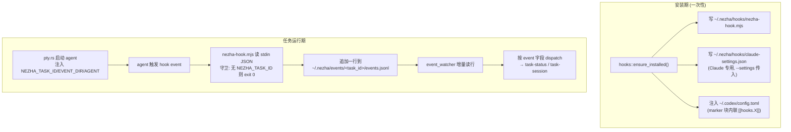

# Claude Code 与 Codex 的 Hook 支持（最新版本）

- **描述**：Claude Code 与 Codex CLI 当前版本的 hook 事件 / payload 字段 / 配置方式 / 信任机制全量对照，以及 Nezha 实际订阅哪些事件、为何这样映射，面向 hook 链路开发与排查。
- **标签**：`hooks`, `claude-code`, `codex`, `event-watcher`, `session-discovery`, `input-required`, `references`

> 本文是**外部能力 + Nezha 用法**的对照参考。两边官方都在快速迭代，事件清单以官方文档为准（[Claude](https://code.claude.com/docs/en/hooks) / [Codex](https://developers.openai.com/codex/hooks)），本文聚焦「Nezha 依赖的子集 + 易踩的字段/信任差异」。截至 2026-06。

---

## 1. 整体流程

Nezha 不直接调 agent API，而是给 agent 注入一个共享 hook 脚本，脚本把事件落盘成 `events.jsonl`，后端轮询解析后驱动任务状态。



**代码路径：**

```
src-tauri/src/hooks.rs
  ├─ ensure_installed()              ← 安装入口:写脚本 + Claude settings + Codex 注入
  ├─ build_claude_settings_value()  ← Claude: 仅含 hooks 的 JSON,经 --settings 传入
  ├─ build_codex_block()            ← Codex: marker 包裹的内联 [[hooks.X]] TOML
  ├─ usable_for(agent)              ← 三条满足(node+已装+版本)才信任 hook,否则回退轮询
  └─ CLAUDE_HOOK_MIN_VERSION / CODEX_HOOK_MIN_VERSION  ← 版本门槛
src-tauri/src/nezha-hook.mjs
  └─ pick(payload, ...keys)         ← 跨 agent 字段名多 key 兜底
src-tauri/src/pty.rs
  ├─ build_codex_cmd() + --dangerously-bypass-hook-trust  (use_hooks 时,须在 -- / resume 前)
  ├─ build_claude_cmd() + --settings <nezha_claude_settings_path>
  └─ NEZHA_TASK_ID / NEZHA_EVENT_DIR / NEZHA_AGENT 环境变量注入
src-tauri/src/event_watcher.rs
  └─ dispatch()                     ← event → task-status / task-session 映射
```

---

## 2. Nezha 落盘的事件行（跨 agent 统一契约）

每次 hook 触发，`nezha-hook.mjs` 把不同 agent 的异构 payload 归一成同一行写入 `events.jsonl`：

```json
{
  "ts": 1733300000000,
  "task_id": "<NEZHA_TASK_ID>",
  "agent": "claude | codex",
  "event": "SessionStart | Stop | PostToolUse | ...",
  "session_id": "<会话 id>",
  "transcript_path": "<jsonl 路径>",
  "cwd": "<工作目录>",
  "tool_name": "<工具名>",
  "permission_mode": "<权限模式>"
}
```

> **注意**：`event` / `session_id` / `transcript_path` 这三个字段在两个 agent 的原始 payload 里**字段名不同**，靠 `pick()` 多 key 兜底拉平（见 §3.3）。后端 `event_watcher::HookEvent` 只反序列化 `task_id / agent / event / session_id / transcript_path` 五个字段。

---

## 3. 字段 / 规则详解

### 3.1 Claude Code 事件支持

Claude 当前版本的 hook 事件远超 Nezha 所需（含 `PostToolBatch`、`FileChanged`、`TaskCreated`、`SubagentStart`、`PermissionDenied`、`StopFailure`、`SessionEnd` 等数十个）。**Nezha 仅订阅 6 个**（`hooks.rs::CLAUDE_EVENTS`）：

| 事件 | Nezha 用途 | 触发时机要点 |
|------|-----------|-------------|
| `SessionStart` | 注册 session（matcher: `startup`/`resume`/`clear`/`compact`） | 会话开始/恢复；resume 时 `source=resume` 会再触发 |
| `UserPromptSubmit` | 复位 `input_required` → `running` | 用户提交 prompt，Claude 处理前 |
| `Notification` | 置 `input_required`（仅工具审批时即时） | matcher: `permission_prompt`/`idle_prompt`/`auth_success`。**`idle_prompt` 约空闲 60s 才触发**（见 §5 与 [[hook_claude_stop_badge_delay]]） |
| `PostToolUse` | 复位 `input_required` → `running` | 工具成功后；工具审批不触发 `UserPromptSubmit`，必须靠它复位 |
| `Stop` | 置 `input_required`（本轮结束、等输入） | AI 完成一轮响应。**Nezha 主要依赖项**，不靠 `Notification` 兜底 |
| `SubagentStop` | 不主动 emit，交 PTY exit monitor | 子代理结束，主代理仍在工作 |

Claude 端关键能力：
- **配置合并语义**：`hooks` 是数组型 key，跨 settings 来源 **concat + 按 command 去重**，不会覆盖用户 hook。Nezha 据此走 `--settings <自有文件>`，**完全不改用户 `~/.claude/settings.json`**。
- **退出码**：`exit 0` = 成功（stdout 可回传 JSON 决策/上下文）；`exit 2` = 阻断（对 `Stop`/`SubagentStop` 意味"继续工作"，须查 `stop_hook_active` 防死循环）。Nezha 脚本永远 `exit 0`，纯观测不干预。
- **handler 类型**：`command` / `http` / `mcp_tool` / `prompt` / `agent`。Nezha 用 `command`。

### 3.2 Codex 事件支持

Codex hooks 从 0.99（AfterAgent）→ 0.114（实验引擎，含 SessionStart/Stop）演进，**0.124.0（2026-04-23）起 stable 且默认开启**。当前官方事件：`SessionStart`、`SubagentStart`、`PreToolUse`、`PermissionRequest`、`PostToolUse`、`PreCompact`、`PostCompact`、`UserPromptSubmit`、`SubagentStop`、`Stop`（**注意：Codex 无 `Notification` 事件**）。**Nezha 订阅 6 个**（`hooks.rs::CODEX_EVENTS`）：

| 事件 | Nezha 用途 | 备注 |
|------|-----------|------|
| `SessionStart` | 注册 session（matcher: `startup`/`resume`/`clear`，clear 自 0.120+） | 线程/会话初始化 scope |
| `UserPromptSubmit` | 复位 → `running` | turn scope |
| `PermissionRequest` | 置 `input_required`（等审批，对应 Claude 的 Notification 角色） | turn scope |
| `PostToolUse` | 复位 → `running` | 自 0.124 支持 |
| `Stop` | 置 `input_required`（本轮结束、等输入） | turn scope |
| `SubagentStop` | 不主动 emit | — |

Codex 端关键差异：
- **Feature flag**：现在**默认开启**。`hooks` 是 canonical 键，`codex_hooks` 是 **deprecated 别名**。禁用方式 `[features] hooks = false`；企业可用 `requirements.toml` 的 `allow_managed_hooks_only` / `[features].hooks = false` 强制。
- **Windows 执行**：hooks **在 Windows 上启用**（0.118 前后曾短暂禁用，后经 `commandWindows` 机制恢复）。command hook 字符串经 **`cmd.exe /C`** 执行（Unix 经 `/bin/sh -lc`），**不是 PowerShell**；另有 `commandWindows`/`command_windows` 覆盖字段可单独指定 Windows 命令。`command` 只能是字符串，**无 args 数组**（不像 Claude 有 exec form）。源码核实自 `codex-rs/hooks/src/engine/command_runner.rs`。
- **配置格式**：`hooks.json` 或 config.toml 内联 `[[hooks.X]]` 二选一（同层两者并存会 merge 并告警）。Nezha 用 config.toml 内联，marker 块 `# >>> nezha-managed-begin ... <<<` 包裹，区域外用户内容按字符串切片保留。
- **信任机制（关键坑）**：非 managed 的 command hook **必须先 review + trust 才会运行**，Codex 按 hook hash 记录信任，新/改 hook 默认 skip。详见 §5 与 [[feat_hooks_codex_gaps]]。

### 3.3 跨 agent payload 字段名差异（最易踩）

同一语义在两个 agent 的原始 stdin JSON 里字段名可能不同，`nezha-hook.mjs::pick()` 按优先级多 key 兜底：

| 语义 | Claude 字段 | Codex 字段 | nezha-hook.mjs 兜底顺序 |
|------|------------|-----------|------------------------|
| 事件名 | `hook_event_name` | `hook_event_name`（新版已与 Claude 收敛；旧版曾用 `event_name`） | `hook_event_name` → `event_name` → `hookEventName` → `event` |
| 会话 id | `session_id` | `session_id`（新版收敛；旧版曾用 `conversation_id`） | `session_id` → `conversation_id` → `sessionId` → `conversationId`，再退 `CODEX_SESSION_ID` / `CLAUDE_CODE_SESSION_ID` 环境变量 |
| 转录路径 | `transcript_path` | `rollout_path` / `transcript_path` | `transcript_path` → `transcriptPath` → `rollout_path` |
| 权限模式 | `permission_mode` | `permission_mode` | `permission_mode` → `permissionMode` |

> **为何多 key 兜底而非认定单一字段名**：Codex 文档当前列出的 common 字段已是 `session_id` / `hook_event_name`（与 Claude 收敛），但历史版本/早期实验引擎用过 `conversation_id` / `event_name`。多 key + 环境变量兜底让脚本对两个 agent 的多个版本都鲁棒，避免取到空 `session_id` 导致 `handle_session_start` 提前 return、session 注册不上（这正是 [[feat_hooks_codex_gaps]] 记录的历史 bug #2）。

### 3.4 Nezha 的 event → task-status 映射

`event_watcher.rs::dispatch()` 把归一后的 event 映射为任务状态：

```
SessionStart                       → handle_session_start (注册 session + emit task-session)
Notification | PermissionRequest   → task-status = input_required   (等待用户/审批)
UserPromptSubmit | PostToolUse     → task-status = running           (复位 input_required)
Stop                               → task-status = input_required    (本轮结束、等输入)
SubagentStop | 其它                → 不处理 (交 PTY exit monitor 处理终态)
```

> `emit_active_status` 带 `child_handles` 存活守卫：进程真退出后不再误发 `input_required`/`running`，终态统一归 PTY exit monitor。

### 3.5 注入方式对照

| 维度 | Claude | Codex |
|------|--------|-------|
| 配置入口 | 命令行 `--settings <~/.nezha/hooks/claude-settings.json>` | 内联注入 `~/.codex/config.toml` marker 块 |
| command 形态 | 裸 `node "<script>"`(单字符串,跨 shell 安全) | 裸 `node "<script>"`(单字符串;Codex `command` 仅支持字符串、无 args 数组) |
| 是否改用户配置 | **否**（自有文件，靠 merge 语义共存） | 是（但 marker 块外用户内容完整保留 + 卸载可精确移除） |
| 信任绕过 | 无需 | `--dangerously-bypass-hook-trust`（**必须加在 `--` / `resume` 之前**） |
| 升级/卸载幂等 | 删自有文件 + 清理旧版残留注入 | marker 块整体替换 / 移除 |

---

## 4. 版本门槛（usable_for 判定）

`hooks.rs::usable_for(agent)` 三条**同时**满足才信任 hook 链路、关掉轮询兜底；任一不满足回退 `/status` 轮询。版本号统一走 `app_settings` 的全局带缓存探测（不再读项目级 config）。

| agent | 最低版本 | 来源 |
|-------|---------|------|
| Claude | `2.1.87`（`CLAUDE_HOOK_MIN_VERSION`） | 沿用现代会话机制门槛（已具备 SessionStart/Notification/UserPromptSubmit）。命令走裸 `node "<script>"` shell form，跨平台/跨 shell 均成立，无需更高门槛 |
| Codex | `0.124.0`（`CODEX_HOOK_MIN_VERSION`） | hooks Stage::Stable 且默认开启的首个版本 |

三条件：① `node` 可用（`detect_node()`，realpath 绕开 nvm/asdf shim）② 对应 agent 已安装 hook ③ agent 版本 ≥ 门槛。

---

## 5. 错误处理与拒绝条件

| 条件 | 行为 | 后果 / 排查 |
|------|------|-----------|
| `node` 不在 PATH | `ensure_installed` 返回 `error="node not found"`，`usable_for` 恒 false | 全部回退轮询；hook 脚本是 .mjs，无 node 无法运行 |
| agent 版本 < 门槛 | `readiness.reason="version_too_low"`，`usable_for`=false | 回退轮询 |
| hook 未安装 | `reason="not_installed"` | 回退轮询 |
| **Codex hook 未 trust** | Codex 静默 skip 该 hook | `events.jsonl` 为空 → session 发现/状态全失效。Nezha 用 `--dangerously-bypass-hook-trust` 规避；**flag 必须在 `--`/`resume` 前**，否则 Codex 不识别。验证法：跑 codex 任务看 `~/.nezha/events/<task_id>/events.jsonl` 是否有行 |
| Codex 取到空 `session_id` | `handle_session_start` 提前 return | session 注册不上。多 key + 环境变量兜底防御（§3.3） |
| **Claude 等输入角标晚 ~60s** | 误依赖 `Notification(idle_prompt)` 兜底 | `idle_prompt` 空闲约 60s 才触发；**必须用 `Stop` 即时置 `input_required`**（实测 Stop→Notification 恰 +60s）。详见 [[hook_claude_stop_badge_delay]] |
| 脚本无 `NEZHA_TASK_ID`/`NEZHA_EVENT_DIR` | `nezha-hook.mjs` 立即 `exit 0` | 用户手动跑 agent 时零副作用（守卫设计） |
| 脚本内部任何异常 | catch 吞掉，`exit 0` | 绝不让 hook 失败阻塞 agent |
| **Windows 报 `hook exited with code 1`** | Node 读管道 stdin 到 EOF 抛 `EOF: end of file, read` 的 `'error'` 事件，无监听器 → 未捕获异常 → 进程 exit 1 | Unix 干净触发 `'end'`，Windows 抛 `'error'`（agent 写完 payload 关闭管道触发）。修复：`nezha-hook.mjs` 必须给 `process.stdin.on('error', finish)` + `process.on('uncaughtException', finish)`（finish 幂等，用已收 payload 落盘并 `exit 0`）。脚本落盘逻辑全在 try/catch 内，exit 1 永远来自 stdin 流的未捕获 error，而非落盘逻辑 |
| **Windows 报 `UnexpectedToken` / hook 启动失败** | hook command 交 shell 执行（Claude:Git Bash 不存在时兜底 PowerShell；Codex:部分版本走 PowerShell）；带引号的 node 全路径 `"<node>" "<script>"` 在 **PowerShell** 下首个 `"quoted"` token 被当成字符串字面量,第二个路径处报 UnexpectedToken（即"字符串 + 另一个字符串"） | **生效配置:Claude `~/.nezha/hooks/claude-settings.json`、Codex `~/.codex/config.toml`,均由生成器（`build_claude_settings_value` / `build_codex_block`）写出,`ensure_installed` 启动期每次重写。** 修复:命令统一改为**裸 `node "<script>"`**——首个 token 是裸命令名,cmd.exe / PowerShell / Git Bash / sh 都按「调用 PATH 上的 node」解析,一套写法修好两个 agent、无需 exec form / 版本门槛。**反模式**:带引号的 node 全路径在前;**误区**:给 PowerShell 加 `&` 只在 PowerShell 成立,bash/cmd 下反而报错。代码改完须重启 app(或调 `install_hooks`)重写磁盘旧配置 |

---

## 6. 典型示例

### 6.1 Claude 跑完一轮等输入（happy path）

`events.jsonl` 增量行：

```json
{"ts":1733300000000,"task_id":"t_abc","agent":"claude","event":"Stop","session_id":"sess_x","transcript_path":"/Users/u/.claude/projects/.../sess_x.jsonl","cwd":"/repo","tool_name":"","permission_mode":"default"}
```

**dispatch 结果**：

```
event = "Stop"  → emit_active_status(input_required)   ← 角标即时亮起,不等 60s Notification
```

### 6.2 Codex 工具审批后继续（复位）

```json
{"ts":1733300005000,"task_id":"t_abc","agent":"codex","event":"PostToolUse","session_id":"conv_y","transcript_path":"/repo/.codex/sessions/conv_y.jsonl","cwd":"/repo","tool_name":"shell","permission_mode":"on-request"}
```

**dispatch 结果**：

```
event = "PostToolUse"  → emit_active_status(running)    ← 清除 input_required(工具审批不发 UserPromptSubmit)
session_id 经 pick() 从 Codex 原始 conversation_id/CODEX_SESSION_ID 兜底而来
```

---

## 7. 扩展指引：接入新 agent 的 hook

1. 在 `hooks.rs` 加 `<AGENT>_EVENTS` 常量，仅订阅 Nezha 需要的语义事件（session 注册 / 等输入 / 复位）。
2. 在 `nezha-hook.mjs::pick()` 的兜底 key 列表补该 agent 的字段名 + 兜底环境变量。
3. 选注入方式：能走命令行 flag（如 Claude `--settings`）优先，不改用户配置；否则用 marker 块内联且保证卸载可精确移除。
4. 若该 agent 有 hook 信任机制（如 Codex），评估是预置 trusted_hash（更安全）还是 bypass flag（更简单），在 `pty.rs` 构建命令时按 `use_hooks` 注入。
5. 在 `hooks.rs` 加版本门槛常量 + `usable_for` 分支；版本/node/安装任一不满足必须能回退轮询。
6. 在 `event_watcher.rs::dispatch()` 加该 agent 事件名到 task-status 的映射（注意等输入信号在不同 agent 叫法不同）。

---

## 8. 历史背景

Nezha 早期版本曾直接向用户 `~/.claude/settings.json` 内联注入带 `_nezha_managed` marker 的条目；现已改为命令行 `--settings` 传自有文件，`uninject_claude_settings_at` 仅用于清理旧版残留。Codex 侧曾因未处理 hook trust（hook 被静默 skip）+ `session_id` 字段名错（只读 `session_id` 未兜底 `conversation_id`）导致链路失效，已分别用 `--dangerously-bypass-hook-trust` 和多 key `pick()` 修复。cmux（同类 AI-agent 终端）的参考做法是 Codex 预置 `trusted_hash`（不降级安全），Nezha 选了更简单的 bypass flag。

---

**相关文档：**

- [终端渲染与选区卡顿排查](../xterm/rendering-and-selection-lag.md) — 同属 Nezha 桌面壳的独立技术线（无直接依赖）
- 记忆 [[feat_hooks_codex_gaps]] — Codex hook 三处历史隐性 bug（trust / 字段名 / 环境变量）+ cmux 两套参考实现
- 记忆 [[hook_claude_stop_badge_delay]] — Claude 等输入角标晚 60s 真因：必须用 Stop 而非 Notification(idle_prompt) 置 input_required
